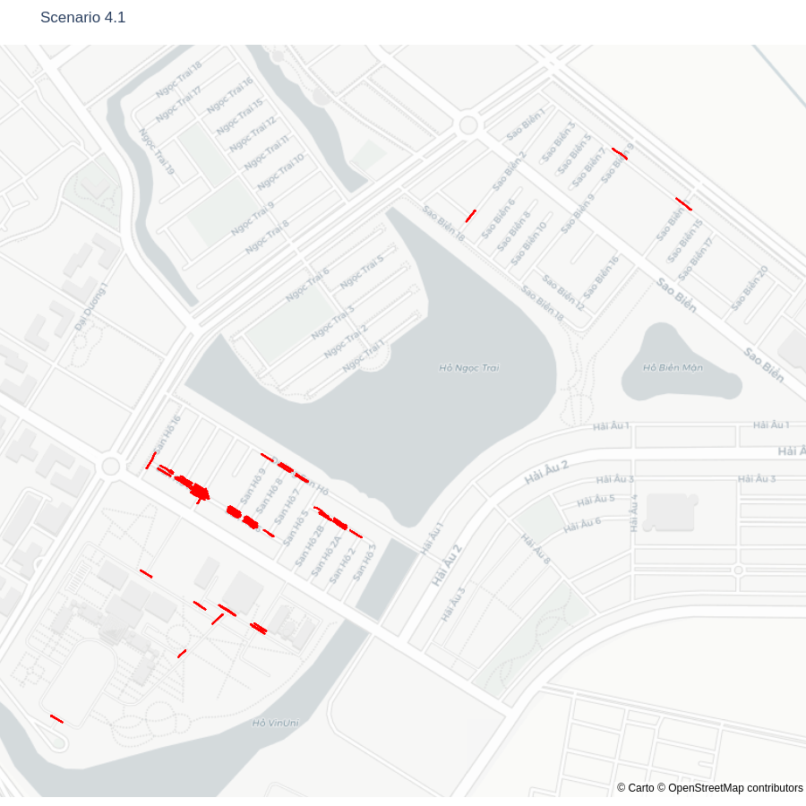

# Geographical distribution of collected data
Reads a dataset from a specified paths and plots data point's location on maps.

## Usage
Install required packages (python 3.10.x is preferable)
```bash
pip install -r requirements.txt
```
Change `"data_path"` in `config.json` and run
```bash
python plot_map.py
```
These commands will plot individual scenairos in different figures. <br>
If yop want to plot all the scenarios on a single picture, you can change the variable `"full_scenarios"` in `config.json` to `true`.
### Example output

