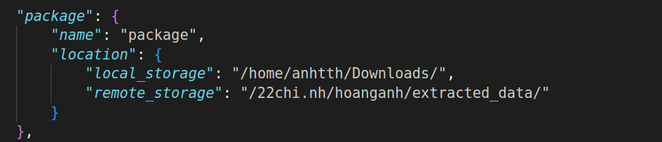

# Data management

## Introduction
This program is for data management, including tasks such as:
- Finding and selecting data based on specific criteria.
- Uploading, downloading, and transmitting data between local machines and servers.
- Compressing selected data into a single package.
- Decompressing packages and forwarding data to the appropriate directories.

## Usage
This programs require Python 3.7.16

Before executing any functions, make sure to update the ```config.json``` file with the appropriate criteria, local machine directories, and server settings.

### 1. Package selected data
This function generated a zip file named `package.name` in the directory specified by the `package.location.local_storage` attribute in `config.json`. 
``` bash
bash zip.sh
```

During the execution of `zip.sh`, the script `python select.py` will also run automatically. This script selects the data records that meet the specified criteria for compression. You can review the selected data by checking the `selected_data_list.log` file.

Once the data compression is completed, you will be prompted to enter a password to encrypt the zipped file. This password will be needed later to unzip the file.

### 2. Unzip package
This function move zipped package in the location specified by `package.location.local_storage` to the folder specified by `local_storage.directory` and unzip inside that folder.
First, specify the path of the zipped package (`local_storage`) in `config.json`
<!--  -->

Run the comannd
``` bash 
bash unzip.sh
```
Data package will be unzipped and each data folder will be forwarded to appropriate location in side the data storage specified by `local_storage.directory`
<!--  -->

Directory structure of unzipped data will look like this:


*Note*: Data zipping and unzipping must be performed locally.

### 3. Transmit data
You first need to modify the server configuration and update location of the data package that needs to be transferred:
<!--  -->


<!--  -->

Run `bash transmit.sh upload` or `bash transmit.sh download` to upload or download data

## Configuration
The configuration for the data management program is outlined in `config.json`.
<!-- - The `package` variable sets the `name` of the zip file and its `location` (either in `local_storage` or `remote_storage`).
- The `criteria` details the conditions for selecting data.
- The `local_storage.directory` indicates the specific location for data storage on the local machine.
- `remote_storage` includes details like `ssh_address` and `server_type` (ssh or aws). -->
- `package`: specify feature of data package, which is above to be transmitted.
    - `name`: name of the package
    - `location.local_storage`: directory to store the package on the local device.
    - `location.remote_storage`: directory to store the package on the remote server.
- `criteria`: specify the details the conditions for selecting data.
- `local_storage`: 
    - `directory`: the directory where data is stored on the local device
- `remote_storage`
    - `server_type`: Currently, only SSH and AWS are supported.
    - `ssh_address` (used for ssh server): ssh address including username and ip
    - `aws_bucket `(used for aws server): bucket to store the data (currently `s3`)